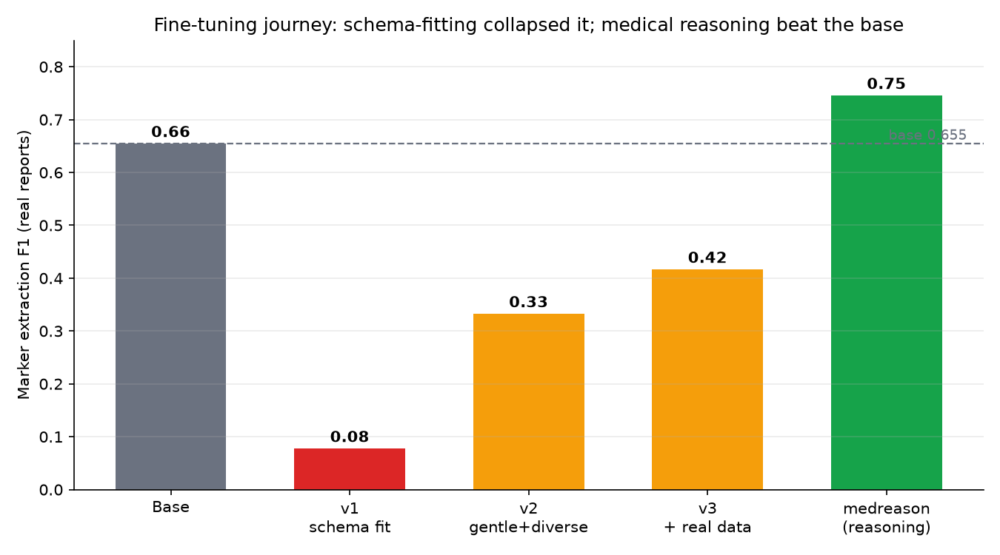
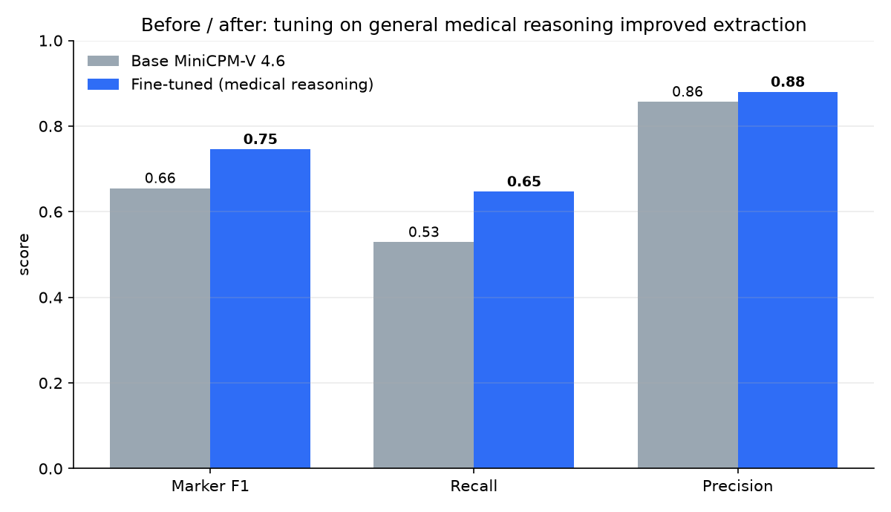

# Blood Test Explainer, teaching a 1.3B model to read your lab report, offline

We are **Roman and Dimitris**, graduates of the **American College of Greece (Deree) AI Lab**, where we currently do research. We built *Blood Test Explainer* for the Build Small hackathon. You upload a photo or PDF of a blood test, and a small model running entirely on the Space reads it, pulls out the markers, values and reference ranges, and explains what each one means in plain language, grounded in a medical knowledge base.

**Our inspiration was a real problem for real people.** Almost everyone has stared at a lab report, seen a column of numbers and "H"/"L" flags, and had no idea what any of it meant. The information is right there, but it is locked in medical shorthand, and it is exactly the kind of private data you do not want to paste into a chatbot you do not control. We wanted a tool a parent or a neighbor could use on their own laptop, that reads the report, explains it honestly, and never sends their health data anywhere.

Here is the whole pipeline:

```
PDF / image  ->  MiniCPM-V 4.6 (vision)  ->  structured JSON  ->  KB-grounded explanation
                 reads the document          markers + values     per-marker + patterns
```

To make it easy to evaluate, we organized this write-up around the **six merit badges** (each one maps to a concrete engineering decision) and then the **three sponsor technologies** that made it possible.

---

## 🔌 Off the Grid

The whole thing runs on the model in front of you. MiniCPM-V 4.6 is loaded inside the Space and does the reading there; there is no call to OpenAI, Anthropic, or any hosted inference API. For a health tool this is not a nice-to-have, it is the point: your blood test never leaves the machine it is processed on. The same design runs on a laptop with the model on local hardware, which is what "small models, local-first" is supposed to feel like.

## 🎯 Well-Tuned

This is the part we are proudest of, because it started as a failure. The base MiniCPM-V 4.6 is already a strong document reader, so our first instinct was to fine-tune it on our exact extraction schema. That collapsed the model: by memorizing our narrow synthetic format it forgot how to read a real report, and field-level F1 on real reports dropped from 0.66 to 0.08.

We built a field-level evaluation (precision / recall / F1 on hand-labeled real reports) so we could measure every change honestly. Here is the whole journey:

| Iteration | What we did | Marker F1 | Recall | vs base |
|---|---|---|---|---|
| **Base MiniCPM-V 4.6** | nothing | **0.655** | 0.529 | |
| v1, schema LoRA | fit our JSON schema (4k synthetic, 2 epochs, lr 1e-4) | 0.078 | 0.059 | catastrophic |
| v2, gentler + diverse | lr 2e-5, 1 epoch, varied synthetic layouts | 0.333 | 0.265 | still worse |
| v3, + real reports | mixed in real labeled reports, oversampled | 0.417 | 0.294 | still worse |
| **medreason (100 ex)** | **fine-tune on general medical reasoning** | **0.746** | **0.647** | **+0.09** |
| medreason (4000 ex) | more reasoning data | 0.667 | 0.559 | +0.01 |



The breakthrough was to stop teaching the model our schema and teach it general medical knowledge instead. We took a LoRA, froze the vision encoder, and fine-tuned only the language layers on a general medical-reasoning dataset (FreedomIntelligence/medical-o1-reasoning-SFT), text only, nothing about extraction. The model got *better* at extraction (F1 0.66 to 0.75, recall 0.53 to 0.65) because it became a better medical reader in general. A second surprise: 100 reasoning examples beat 4,000, so less was more. We then merged the LoRA into the base and published a single standalone model on the Hub, which is what the Space loads.



## 🦙 Llama Champion

The app ships two interchangeable backends behind one interface. On CPU Basic Spaces, the default `auto` backend runs the base MiniCPM-V 4.6 GGUF through **llama.cpp** on CPU. On ZeroGPU/GPU, the same `auto` setting uses the fine-tuned Transformers model. We install the prebuilt llama.cpp wheel so the Space builds without a slow source compile, and the operator can still force the GGUF lane explicitly with `EXTRACTOR_BACKEND=llamacpp-gpu` and `LLAMACPP_VISION=1`.

## 🎨 Off-Brand

The interface is a custom frontend, not the default Gradio look. We built a guided three-step "agent trace" (read the document, extract the values, explain the results) with custom HTML/CSS report cards, marker status styling, a workflow timeline, and embedded explanation videos next to flagged markers. The goal was for a non-technical person to follow what the app is doing at every step, instead of facing a bare form.

## 📡 Sharing is Caring

We published our extraction and interpretation **traces on the Hub** as a dataset, so anyone can see exactly what the model read from each report, what it produced, and how the knowledge base turned that into an explanation. It is a small contribution back to the community building on small models, and a transparent record of how the agent behaves.

## 📓 Field Notes

This article is the Field Notes entry. We wanted it to be honest about the parts that did not work (the fine-tune that made things worse) as much as the parts that did, because the most useful thing we can hand the next team is the lesson: do not fine-tune a capable base model on your own narrow output schema, and measure everything before you trust it.

---

## OpenBMB, the model at the center

MiniCPM-V 4.6 is the heart of the project. At roughly 1.3B parameters it is small enough to run offline on the Space and on a laptop, which is the whole premise, yet capable enough to read messy, real-world lab report layouts directly from an image with no separate OCR step. It is also what we fine-tuned for medical reasoning, and it is the model the app ships. Everything the user sees, extraction and explanation, comes from one OpenBMB model.

We also lean on a strict JSON contract from the model so the rest of the app is deterministic:

```json
{
  "patient": { "age": "45", "age_years": 45.0, "sex": "male" },
  "tests": [
    { "marker": "Hemoglobin", "value": "12.5", "unit": "g/dL",
      "reference_range": "13.0 - 17.0", "status": "low",
      "source_text": "Hemoglobin 12.5 g/dL  13.0-17.0  L", "confidence": 0.0 }
  ],
  "notes": []
}
```

## Modal, where the fine-tuning ran

Every training run, the LoRA merge, and the before/after evaluations ran on **Modal** with an A100. The generator builds its own synthetic data on the box, the LoRA trains, the adapter merges into the base, and the merged model is pushed to the Hub, all as Modal functions. Modal also let us iterate fast through the failed runs and the recovery without managing any infrastructure, which is the only reason we found the medical-reasoning approach in time.

## Codex (OpenAI), how we built fast

We used **Codex** as the commit and pull-request engine throughout. Two people moving quickly under a deadline meant a lot of small, reviewable PRs, and Codex handled the commit/PR mechanics so we could keep our attention on the model and the product. It is also how we kept the repository history clean while the architecture changed underneath us more than once.

---

## The knowledge base and grounding

Across all of this, one rule held: the model never invents medical facts. The facts live in a curated knowledge base, what each marker measures, what a high or low value is commonly associated with, and questions worth asking a doctor, and the model only phrases them. The KB grew from 31 markers to **107 markers with curated explanation videos**, plus **cross-marker patterns** (anemia picture, iron-deficiency, B12, a liver-enzyme cluster, lipid/cardiovascular risk, kidney, thyroid, glycemic) that mean more together than alone.

## Limitations and safety

This is an educational tool, not a diagnosis, and every report says so. The model can misread a value, especially on noisy scans, and our labeled evaluation set is still small, so we treat the numbers as directional. It should help someone understand their results and ask better questions of a clinician, not replace one.

---

*Built by Roman and Dimitris, American College of Greece (Deree) AI Lab. Thanks to the Build Small hackathon, Gradio, Hugging Face, OpenBMB, OpenAI, and Modal.*
